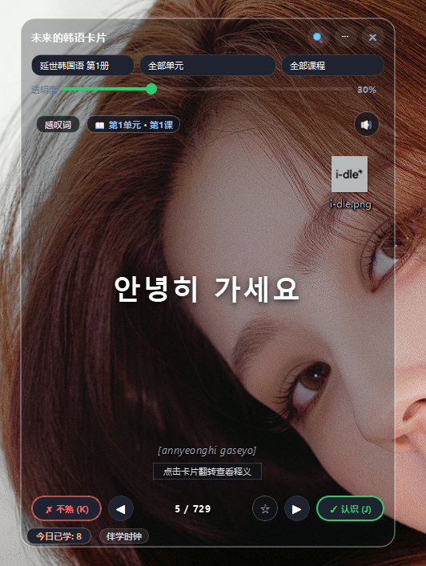
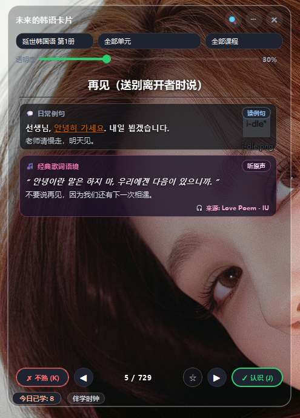
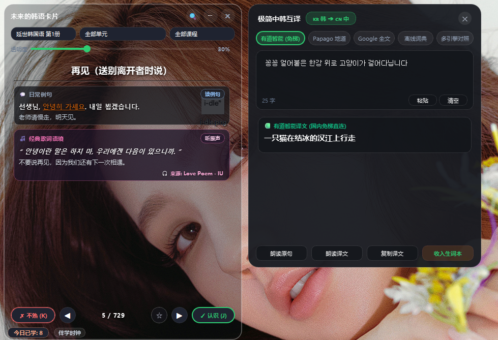
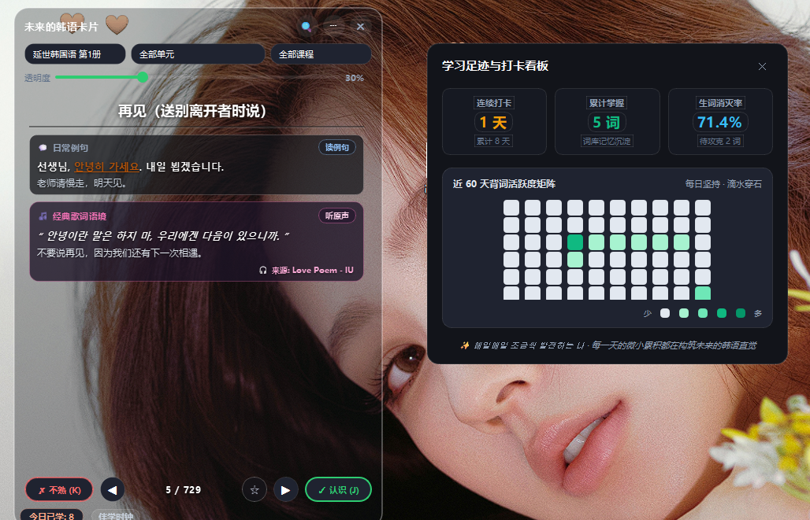

# 未来的韩语卡片


一个 Windows 桌面端韩语悬浮背单词卡片。内置延世韩国语全套词库（**6 册 / 300 课 / 4,677 词**），另含测试导入词书 1 册 3 词，边背边听真人发音，支持剪贴板划词翻译、韩语变位解析、助词高亮、番茄钟与学习打卡热力图。

基于 **PyQt6 + edge-tts** 构建，桌面置顶悬浮，边看剧边办公也能背。

## 预览

| 主卡片正面 | 主卡片背面 |
|---|---|
|  |  |

| 翻译抽屉 | 学习热力图 |
|---|---|
|  |  |

> 截图保存在 `docs/screenshots/` 下（仓库未随附，待补）。

---

## 内置词库

开箱即用，无需联网下载词表。

| 册 | 课数 | 词数 |
|---|---|---|
| 延世韩国语 第 1 册 | 50 | 729 |
| 延世韩国语 第 2 册 | 50 | 749 |
| 延世韩国语 第 3 册 | 50 | 800 |
| 延世韩国语 第 4 册 | 50 | 799 |
| 延世韩国语 第 5 册 | 50 | 800 |
| 延世韩国语 第 6 册 | 50 | 800 |
| 测试导入词书（开发用） | 1 | 3 |
| **合计** | **301** | **4,680** |

**每个词条包含 11 个字段**：韩语原形、汉字词对照、罗马音、词性、中文释义、韩语例句、例句翻译、词类、来源、歌词引用。

其中 **4,069 词**带汉字词（한자어）对照，可一键查看韩语汉字词对应的汉字与字源。

**词性分布**：名词 3,574 · 表达 596 · 动词 293 · 形容词 134 · 代词 22 · 副词 22 · 数词 13 · 量词 12 · 感叹词 9 · 助词 2

另支持自定义导入（`core/vocab_importer.py`），可把自己的词表并进现有词库。

---

## 核心功能

### 背单词

| 功能 | 说明 |
|---|---|
| 悬浮卡片 | 桌面置顶，不挡视线，可调透明度与圆角 |
| 正反面翻转 | 正面韩语 / 背面释义、例句、汉字词、发音规则 |
| 掌握度标记 | 「认识 J」「不熟 K」，不熟的词自动加权进入复习池 |
| 随机乱序 | 打乱顺序，避免靠位置死记硬背 |
| 极简紧凑模式 | 隐藏导航与辅助栏，只留单词 |
| 迷你磁吸条 | 34px 胶囊条吸附屏幕边缘，随时切换 |
| 鼠标穿透 | 锁定位置后点击可穿透，边办公边背 |

### 发音

- **在线**：edge-tts 合成，女声 `ko-KR-SunHiNeural` / 男声 `ko-KR-InJoonNeural`
- **缓存秒播**：音频落盘缓存，命中即毫秒级播放，切词时后台预抓周边单词
- **离线兜底**：无网自动回退 pyttsx3 / Windows SAPI5

### 韩语学习工具

| 工具 | 说明 |
|---|---|
| 变位解析 | 습니다체、았/었어요、-(으)ㄹ 거예요、-고、-(으)면、-지만 等 |
| 助词高亮 | 句中助词自动识别与高亮，配语法注释 |
| 发音规则 | 连音、鼻音化、流音化、紧音化、腭化、ㅎ 脱落 |
| 汉字音转换 | 韩语汉字词与汉字对照（4,069 词） |
| 拼写测验 | 听音拼写练习 |
| 字帖生成 | 生成韩语临摹字帖 PDF / PNG |

### 效率与陪伴

| 功能 | 说明 |
|---|---|
| 划词翻译 | 监听剪贴板，任意软件选中即弹翻译抽屉 |
| 多引擎翻译 | Papago / Google / MyMemory / 有道，可切换 |
| 番茄钟 | 自定义专注时长 |
| 白噪音 | 首尔小雨 / 咖啡馆环境 / 纯净白噪音 + 结束磬音 |
| 统计看板 | 每日学习量、掌握曲线、打卡热力图 |
| 老板键 | 一键隐藏到系统托盘 |
| 开机自启 | 随 Windows 启动 |
| 备份恢复 | 词库与学习进度导出导入 |
| 主题 | 首尔夜色（深黑磨砂）、奶油拿铁（极简米白）、抹茶薄荷（墨绿翠光）、暗夜紫罗兰（暗熏紫粉） |

---

## 快捷键

全部可在设置里自定义，含冲突检测。

| 按键 | 功能 |
|---|---|
| `Space` | 翻转卡片正反面 |
| `J` | 标记「认识」并切换下一词 |
| `K` | 标记「不熟」并加权复习 |
| `R` | 重播韩语原声发音 |
| `S` | 收藏 / 取消生词 |
| `F2` | 迷你磁吸条开关 |
| `Ctrl+T` | 呼出翻译抽屉 |
| `Ctrl+L` | 锁定位置 + 鼠标穿透 |
| `Ctrl+Shift+T` | 番茄钟 |
| `Ctrl+Shift+C` | 剪贴板划词监听开关 |
| `Ctrl+I` | 学习统计与热力图 |
| `Ctrl+M` | 极简紧凑模式 |
| `Ctrl+R` | 随机乱序开关 |
| `Ctrl+H` | 老板键隐藏窗口 |
| `Esc` | 关闭弹层 / 退出测验 |

---

## 安装

### 方式一：直接装 exe

到 [Releases](https://github.com/uminrae/korean-flashcards/releases) 下载 `KoreanFlashcards_Setup_v1.1.exe`（59 MB）双击安装。

> GitHub 的 Release 附件不支持中文文件名，所以安装包用了英文名；安装后应用显示名仍是「未来的韩语卡片」。

### 方式二：跑源码

```bash
pip install -r requirements.txt
python -X utf8 main.py
```

依赖：PyQt6、edge-tts、pygame-ce、pyttsx3、aiofiles、aiohttp

### 打包

```bash
python build_exe.py          # PyInstaller 打包
python build_installer.py    # 生成安装包（需 Inno Setup）
```

---

## 目录结构

```
core/        核心逻辑 22 个模块：词库、TTS、变位、助词、发音规则、
             汉字音、统计、翻译、番茄钟、白噪音、字帖、备份、老板键
ui/          界面层 16 个模块：主窗口、卡片、托盘、各类对话框
utils/       路径与资源工具
config/      全局常量与主题预设
data/        词库与生词本
assets/      应用图标
scripts/     验证脚本与词库注入工具
tests/       回归测试
```

---

## 数据与隐私

以下文件**不会**随仓库分发，只留在你本机：

- `config/korean_cards.db` — 学习记录（生词本、掌握度、每日统计、应用状态）
- `data/custom_vocab.json` — 划词收藏的生词
- `data/fonts/` — 字帖用手写字体
- `data/idle_lyrics.json` — 歌词例句数据

首次运行会自动创建前两项。仓库里只有 `data/custom_vocab.example.json` 空模板。

---

## 注意

- **翻译接口**：Papago `n2mt`、有道 `aidemo`、Google `translate_a/single` 均为第三方**非官方**端点，可能随时失效或被限制。MyMemory 是公开免费接口，可作为稳定替代。请勿高频或商用调用。
- **字体**：字帖功能需要自备韩语 TTF，放入 `data/fonts/` 并在 `core/copybook_generator.py` 中修改文件名。
- **歌词数据**：版权归原作者，未随仓库分发。

---

## 关键词

中文：韩语卡片、韩语背单词、延世韩国语、韩语学习、韩语词汇、韩语单词、TOPIK、韩语考试、韩语翻译、桌面韩语、PyQt6 韩语、悬浮背词、剪贴板翻译、韩语变位、韩语助词、韩语汉字词、韩语发音、韩语 TTS、韩语口语、韩语单词书、背单词软件

English: Korean vocabulary flashcards, Korean learning app, Yonsei Korean textbook, TOPIK prep, edge-tts Korean pronunciation, PyQt6 desktop flashcard, clipboard translator, spaced repetition, Hanja converter, Korean particle highlighter, Korean conjugator

## 许可

MIT，见 `LICENSE`。词库内容整理自公开教材，仅供个人学习使用。
